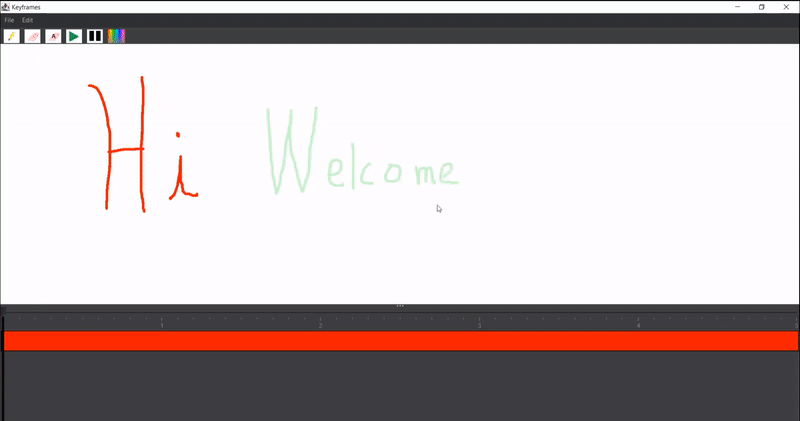

# Keyframes

 

 

A Java Swing desktop application focusing on replicating animation features of Adobe After Effects. The above GIF was
created in Keyframes.

## How to build 
<ul>
<li>cd keyframes</li>
<li>./gradlew.bat build (windows) or ./gradlew build(Linux/Mac)</li>
</ul>

## How to run
 
After building, you should have a built jar. Navigate to the folder with the built jar and execute the following command.
<ul>
<li>java -jar build/libs/keyframes-1.0-SNAPSHOT</li>
</ul>

### Current Features:
<ul>
<li>Paint and erase with different brush sizes and colors (right click the pencil and eraser icons to change sizes)
 
 
    
     
     
</li> 
<li>Frame by frame editing and animation playthrough/preview
     
     
    
     
     
</li>
<li>Drag and drop layers. Layers at the top of the list are drawn on top of layers below.
     
     
    
     
     
    Right click to add a new layer or to change a layer color.
     
     
    
     
     
</li>

<li>FPS and Composition length adjustment</li> 
<li>Session saving (save your work locally as a file and work on it another time!) (Currently Broken - FIXING)</li> 
<li>MP4 rendering; once you're finished, you have a video you can share! (Currently Broken - FIXING)</li>
<li>GIF rendering; share your animation as a video image! (Currently Broken - FIXING)</li>
</ul>

### Future features: 
<ul>
<li>UI Improvement</li>
<li>Shapes (instead of only brushes)</li> 
<li>Fill in color</li> 
<li>User settings (in progress)</li> 
<li>More rendering options (AVI?, different resolutions)</li> 
</ul>
