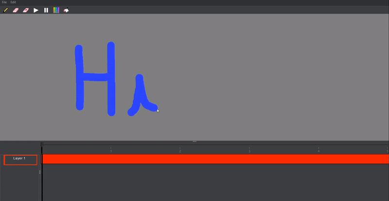
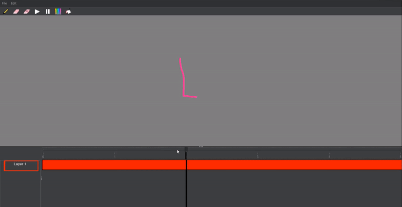
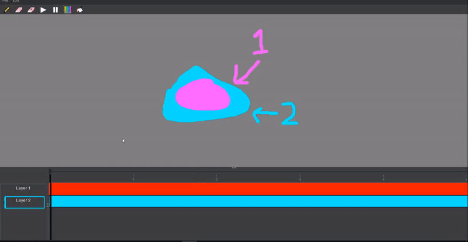
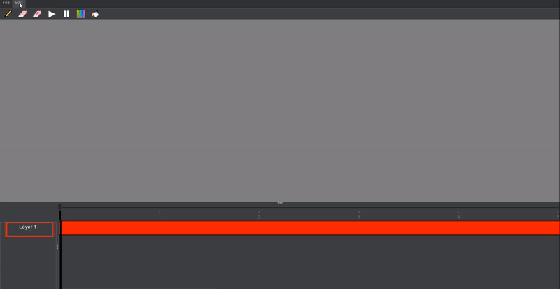
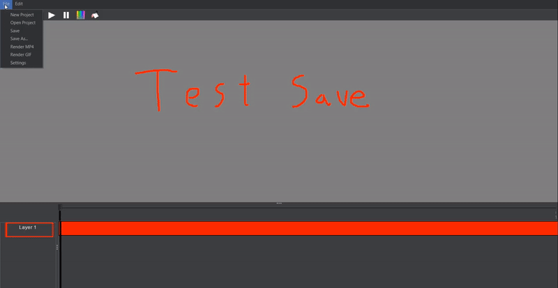
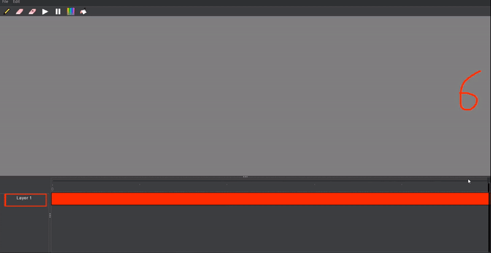
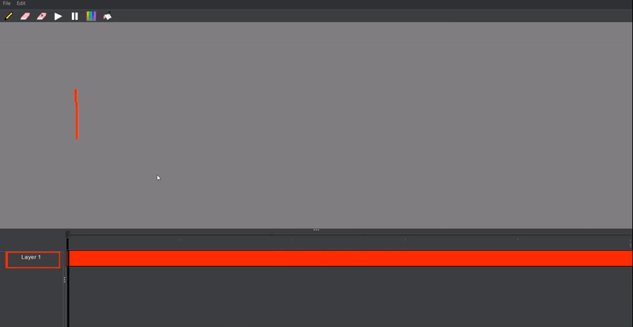

# Keyframes

<br/>

<br />

A Java Swing desktop application focusing on replicating animation features of Adobe After Effects. The above GIF was
created in Keyframes.

## How to run 

Run the application directly from the command line with Gradle using the application plugin.
<br>
<br>
Windows:
```
gradlew.bat run 
```
Linux/Mac
```
./gradlew run
```

If you would like clickable scripts instead, then follow these steps to first create and then run the scripts:
<br>
<br>
Windows:
```
.\gradlew.bat installDist
.\build\install\keyframes\bin\keyframes.bat
```
Linux/Mac
```
./gradlew installDist
./build/install/keyframes/bin/keyframes
```
You can once again run these scripts by double clicking them in your operating system's file explorer.
<br>

### Current Features:
<ul>
<li>Paint and erase with different brush sizes and colors (right click the pencil and eraser icons to change sizes)
<br/>
<br/>
    
    <br/>
    <br/>
</li> 
<li>Frame by frame editing and animation playthrough/preview
    <br/>
    <br/>
    
    <br/>
    <br/>
</li>
<li>Drag and drop layers. Layers at the top of the list are drawn on top of layers below.
    <br/>
    <br/>
    
    <br/>
    <br/>
    Right click to add a new layer or to change a layer color.
    <br/>
    <br/>
    
    <br/>
    <br/>
</li>

<li>FPS and Composition length adjustment
<br/>
    <br/>
    
    <br/>
    <br/>
</li> 
<li>Session saving (save your work locally as a file and work on it some other time!) 
<br/>
    <br/>
    
    <br/>
    <br/>
</li> 
<li>MP4 rendering; share your animation as a mp4 video! 
<br/>
    <br/>
    
    <br/>
    <br/>
</li>
<li>GIF rendering; share your animation as a video image! 
<br/>
    <br/>
    
    <br/>
    <br/>
</li>
</ul>

### Future features: 
<ul>
<li>UI Improvement</li>
<li>Shapes (instead of only brushes)</li> 
<li>Fill in color</li> 
<li>User settings (in progress)</li> 
<li>More rendering options (AVI?, different resolutions)</li> 
</ul>
